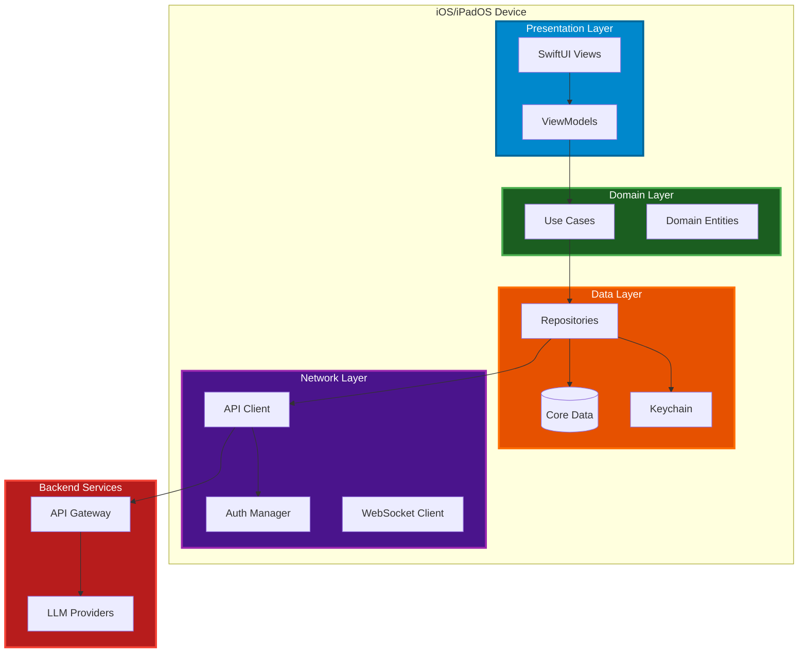
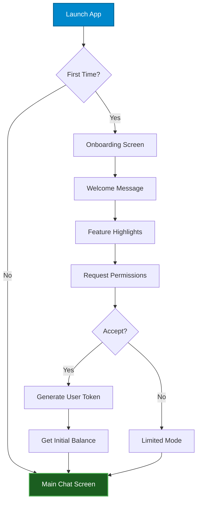
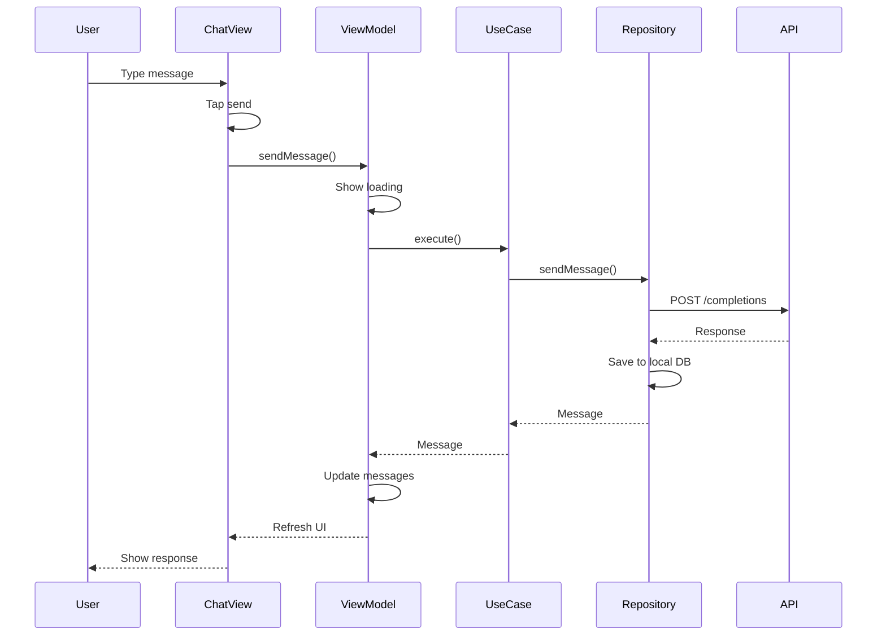

# iOS/iPadOS Application Architecture

## Overview

The iOS/iPadOS application will be a native Swift application providing users with access to the Deep Assistant AI platform. This app will integrate with the existing API Gateway infrastructure to provide a seamless mobile experience for accessing multiple LLM models, chat functionality, and other AI-powered features.

**Target Platform**: iOS 16.0+ / iPadOS 16.0+
**Language**: Swift 5.9+
**UI Framework**: SwiftUI
**Architecture Pattern**: MVVM (Model-View-ViewModel) with Clean Architecture principles
**License**: Unlicense (public domain)

---

## System Architecture

### High-Level Architecture



---

## Application Structure

### Recommended Project Structure

```
DeepAssistant/
├── DeepAssistant/              # Main app target
│   ├── App/
│   │   ├── DeepAssistantApp.swift
│   │   ├── AppDelegate.swift
│   │   └── SceneDelegate.swift
│   │
│   ├── Presentation/
│   │   ├── Common/
│   │   │   ├── Views/
│   │   │   │   ├── LoadingView.swift
│   │   │   │   ├── ErrorView.swift
│   │   │   │   └── EmptyStateView.swift
│   │   │   └── Components/
│   │   │       ├── MessageBubble.swift
│   │   │       ├── ModelPickerView.swift
│   │   │       └── BalanceIndicator.swift
│   │   │
│   │   ├── Onboarding/
│   │   │   ├── Views/
│   │   │   └── ViewModels/
│   │   │
│   │   ├── Chat/
│   │   │   ├── Views/
│   │   │   │   ├── ChatView.swift
│   │   │   │   ├── MessageListView.swift
│   │   │   │   └── InputView.swift
│   │   │   └── ViewModels/
│   │   │       └── ChatViewModel.swift
│   │   │
│   │   ├── Models/
│   │   │   ├── Views/
│   │   │   │   └── ModelSelectionView.swift
│   │   │   └── ViewModels/
│   │   │       └── ModelSelectionViewModel.swift
│   │   │
│   │   ├── Balance/
│   │   │   ├── Views/
│   │   │   │   └── BalanceView.swift
│   │   │   └── ViewModels/
│   │   │       └── BalanceViewModel.swift
│   │   │
│   │   ├── Payment/
│   │   │   ├── Views/
│   │   │   │   └── PaymentView.swift
│   │   │   └── ViewModels/
│   │   │       └── PaymentViewModel.swift
│   │   │
│   │   ├── Settings/
│   │   │   ├── Views/
│   │   │   │   ├── SettingsView.swift
│   │   │   │   └── SystemMessageView.swift
│   │   │   └── ViewModels/
│   │   │       └── SettingsViewModel.swift
│   │   │
│   │   └── History/
│   │       ├── Views/
│   │       │   └── HistoryView.swift
│   │       └── ViewModels/
│   │           └── HistoryViewModel.swift
│   │
│   ├── Domain/
│   │   ├── Entities/
│   │   │   ├── Message.swift
│   │   │   ├── Conversation.swift
│   │   │   ├── AIModel.swift
│   │   │   ├── User.swift
│   │   │   └── TokenBalance.swift
│   │   │
│   │   ├── UseCases/
│   │   │   ├── SendMessageUseCase.swift
│   │   │   ├── GetConversationUseCase.swift
│   │   │   ├── ClearConversationUseCase.swift
│   │   │   ├── GetBalanceUseCase.swift
│   │   │   ├── SelectModelUseCase.swift
│   │   │   └── UpdateSystemMessageUseCase.swift
│   │   │
│   │   └── Repositories/
│   │       ├── ConversationRepository.swift
│   │       ├── UserRepository.swift
│   │       ├── ModelRepository.swift
│   │       └── PaymentRepository.swift
│   │
│   ├── Data/
│   │   ├── Repositories/
│   │   │   ├── ConversationRepositoryImpl.swift
│   │   │   ├── UserRepositoryImpl.swift
│   │   │   ├── ModelRepositoryImpl.swift
│   │   │   └── PaymentRepositoryImpl.swift
│   │   │
│   │   ├── DataSources/
│   │   │   ├── Remote/
│   │   │   │   ├── APIGatewayDataSource.swift
│   │   │   │   └── DTOs/
│   │   │   │       ├── CompletionRequest.swift
│   │   │   │       ├── CompletionResponse.swift
│   │   │   │       ├── TokenResponse.swift
│   │   │   │       └── DialogResponse.swift
│   │   │   │
│   │   │   └── Local/
│   │   │       ├── ConversationDataSource.swift
│   │   │       ├── UserDataSource.swift
│   │   │       └── CoreDataStack.swift
│   │   │
│   │   └── Models/
│   │       ├── CoreData/
│   │       │   ├── DeepAssistant.xcdatamodeld
│   │       │   ├── ConversationEntity.swift
│   │       │   ├── MessageEntity.swift
│   │       │   └── UserEntity.swift
│   │       │
│   │       └── Network/
│   │           └── NetworkModels.swift
│   │
│   ├── Network/
│   │   ├── APIClient.swift
│   │   ├── APIEndpoint.swift
│   │   ├── NetworkError.swift
│   │   ├── AuthManager.swift
│   │   ├── RequestBuilder.swift
│   │   └── ResponseHandler.swift
│   │
│   ├── Common/
│   │   ├── Extensions/
│   │   │   ├── String+Extensions.swift
│   │   │   ├── View+Extensions.swift
│   │   │   └── Date+Extensions.swift
│   │   │
│   │   ├── Utilities/
│   │   │   ├── Logger.swift
│   │   │   ├── Constants.swift
│   │   │   └── KeychainHelper.swift
│   │   │
│   │   └── DependencyInjection/
│   │       ├── DIContainer.swift
│   │       └── ServiceLocator.swift
│   │
│   └── Resources/
│       ├── Assets.xcassets/
│       ├── Localizable.strings (English)
│       ├── Localizable.strings (Russian)
│       ├── Info.plist
│       └── LaunchScreen.storyboard
│
├── DeepAssistantTests/
│   ├── Domain/
│   ├── Data/
│   ├── Network/
│   └── Mocks/
│
└── DeepAssistantUITests/
    └── Flows/
```

---

## Core Components

### 1. Presentation Layer

#### SwiftUI Views

**ChatView.swift** - Main chat interface
- Message list with scrolling
- Input field with send button
- Model selection button
- Balance indicator
- Clear conversation button

**ModelSelectionView.swift** - Model picker
- Grid/List of available models
- Model descriptions
- Energy cost indicators
- Favorites/recent models

**BalanceView.swift** - Token balance display
- Current balance
- Usage history
- Purchase options link

**SettingsView.swift** - App settings
- System message selection/customization
- Language selection
- Theme preferences (light/dark)
- Account management
- Clear cache

#### ViewModels

Using Combine framework for reactive data binding:

```swift
class ChatViewModel: ObservableObject {
    @Published var messages: [Message] = []
    @Published var isLoading: Bool = false
    @Published var errorMessage: String?
    @Published var currentModel: AIModel
    @Published var balance: TokenBalance?

    private let sendMessageUseCase: SendMessageUseCase
    private let getConversationUseCase: GetConversationUseCase
    private var cancellables = Set<AnyCancellable>()

    func sendMessage(_ content: String) async {
        // Use case execution
    }

    func loadConversation() async {
        // Load conversation history
    }
}
```

---

### 2. Domain Layer

#### Entities

**Message.swift**
```swift
struct Message: Identifiable {
    let id: UUID
    let content: String
    let role: MessageRole
    let timestamp: Date
    let conversationId: UUID
}

enum MessageRole {
    case user
    case assistant
    case system
}
```

**AIModel.swift**
```swift
struct AIModel: Identifiable, Codable {
    let id: String
    let displayName: String
    let provider: ModelProvider
    let description: String
    let energyCost: Double
    let capabilities: ModelCapabilities
    let contextWindow: Int
}

enum ModelProvider: String {
    case openai
    case anthropic
    case deepseek
    case meta
}

struct ModelCapabilities {
    let supportsVision: Bool
    let supportsStreaming: Bool
    let supportsToolUse: Bool
}
```

**TokenBalance.swift**
```swift
struct TokenBalance {
    let userId: String
    let energyBalance: Int
    let lastUpdated: Date
}
```

#### Use Cases

**SendMessageUseCase.swift**
```swift
protocol SendMessageUseCase {
    func execute(
        content: String,
        model: AIModel,
        systemMessage: String?
    ) async throws -> Message
}

class SendMessageUseCaseImpl: SendMessageUseCase {
    private let conversationRepository: ConversationRepository
    private let userRepository: UserRepository

    func execute(
        content: String,
        model: AIModel,
        systemMessage: String?
    ) async throws -> Message {
        // 1. Check balance
        // 2. Create user message
        // 3. Send to API Gateway
        // 4. Receive AI response
        // 5. Save both messages
        // 6. Return assistant message
    }
}
```

---

### 3. Data Layer

#### Repositories (Implementation)

**ConversationRepositoryImpl.swift**
```swift
class ConversationRepositoryImpl: ConversationRepository {
    private let remoteDataSource: APIGatewayDataSource
    private let localDataSource: ConversationDataSource

    func sendMessage(
        userId: String,
        content: String,
        model: String,
        systemMessage: String?
    ) async throws -> Message {
        // Call API Gateway /completions endpoint
        let response = try await remoteDataSource.sendCompletion(
            userId: userId,
            content: content,
            model: model,
            systemMessage: systemMessage
        )

        // Save to local database
        try await localDataSource.saveMessage(response.toMessage())

        return response.toMessage()
    }

    func getConversation(userId: String) async throws -> [Message] {
        // Try local first, fallback to remote
        if let local = try? await localDataSource.getMessages(userId: userId) {
            return local
        }

        let remote = try await remoteDataSource.getDialog(userId: userId)
        return remote.messages.map { $0.toMessage() }
    }

    func clearConversation(userId: String) async throws {
        try await remoteDataSource.clearDialog(userId: userId)
        try await localDataSource.clearMessages(userId: userId)
    }
}
```

#### Core Data Models

**ConversationEntity**
- id: UUID
- userId: String
- createdAt: Date
- updatedAt: Date
- relationship: messages (one-to-many)

**MessageEntity**
- id: UUID
- content: String
- role: String
- timestamp: Date
- conversationId: UUID
- relationship: conversation (many-to-one)

**UserEntity**
- id: String
- userName: String
- tokenBalance: Int
- selectedModel: String
- systemMessage: String
- createdAt: Date

---

### 4. Network Layer

#### API Client

**APIClient.swift**
```swift
class APIClient {
    private let baseURL: URL
    private let authManager: AuthManager
    private let session: URLSession

    func request<T: Decodable>(
        _ endpoint: APIEndpoint,
        method: HTTPMethod,
        body: Encodable? = nil
    ) async throws -> T {
        var request = URLRequest(url: endpoint.url(baseURL: baseURL))
        request.httpMethod = method.rawValue
        request.setValue("application/json", forHTTPHeaderField: "Content-Type")

        // Add authentication
        if let token = authManager.adminToken {
            request.setValue("Bearer \(token)", forHTTPHeaderField: "Authorization")
        }

        // Add body
        if let body = body {
            request.httpBody = try JSONEncoder().encode(body)
        }

        // Execute request
        let (data, response) = try await session.data(for: request)

        // Handle response
        guard let httpResponse = response as? HTTPURLResponse else {
            throw NetworkError.invalidResponse
        }

        guard 200...299 ~= httpResponse.statusCode else {
            throw NetworkError.httpError(httpResponse.statusCode)
        }

        return try JSONDecoder().decode(T.self, from: data)
    }
}
```

#### API Endpoints

**APIEndpoint.swift**
```swift
enum APIEndpoint {
    case completions
    case getToken(userId: String)
    case updateToken(userId: String)
    case getDialog(userId: String)
    case clearDialog(userId: String)
    case createReferral
    case getReferralCount(userId: String)

    func url(baseURL: URL) -> URL {
        switch self {
        case .completions:
            return baseURL.appendingPathComponent("/completions")
        case .getToken(let userId):
            return baseURL.appendingPathComponent("/token")
                .appending(queryItems: [
                    URLQueryItem(name: "userId", value: userId)
                ])
        // ... other cases
        }
    }
}
```

---

## API Integration

### API Gateway Integration

The iOS app will communicate with the existing API Gateway using the same endpoints as the Telegram bot:

#### Completions
```swift
POST {baseURL}/completions?masterToken={ADMIN_TOKEN}
Content-Type: application/json

{
    "userId": "ios_user_12345",
    "content": "Hello, AI!",
    "systemMessage": "You are a helpful assistant.",
    "model": "gpt-4o"
}
```

#### Token Management
```swift
GET {baseURL}/token?masterToken={ADMIN_TOKEN}&userId=ios_user_12345

Response:
{
    "id": "abc123...",
    "user_id": "ios_user_12345",
    "tokens_gpt": 8500
}
```

#### Dialog Management
```swift
DELETE {baseURL}/dialog?masterToken={ADMIN_TOKEN}&userId=ios_user_12345
GET {baseURL}/dialog?masterToken={ADMIN_TOKEN}&userId=ios_user_12345
```

### Authentication Strategy

**Option 1: Admin Token (Initial MVP)**
- Store admin token securely in Keychain
- Use for all API requests
- Simple but less secure

**Option 2: User Tokens (Recommended)**
- Each iOS user gets their own token
- Token generated on first launch
- Stored in Keychain
- More secure, per-user tracking

**Option 3: OAuth 2.0 (Future)**
- Full OAuth implementation
- Most secure
- Better for multi-device support

---

## Features Breakdown

### MVP (Minimum Viable Product)

**Phase 1: Core Chat**
- [ ] User onboarding
- [ ] Chat interface (text only)
- [ ] Model selection (GPT-4o, GPT-3.5, Claude)
- [ ] Conversation history (local)
- [ ] Clear conversation
- [ ] Token balance display

**Phase 2: Enhanced Features**
- [ ] System message customization
- [ ] Multiple conversation threads
- [ ] Sync conversation history with API Gateway
- [ ] Dark mode support
- [ ] Localization (English, Russian)

**Phase 3: Advanced Features**
- [ ] Voice input (Siri/Whisper)
- [ ] Image generation (DALL-E)
- [ ] Markdown rendering
- [ ] Code syntax highlighting
- [ ] Export conversations
- [ ] iCloud sync

**Phase 4: Premium Features**
- [ ] In-app purchases
- [ ] Subscription management
- [ ] Referral system
- [ ] Usage analytics
- [ ] Widgets
- [ ] Siri Shortcuts

---

## User Flow

### First Launch Flow



### Chat Flow



---

## Technical Considerations

### Performance

**Optimization Strategies**:
1. **Lazy Loading**: Load messages on-demand
2. **Pagination**: Load conversation history in chunks
3. **Caching**: Cache API responses using URLCache
4. **Image Optimization**: Compress and cache images
5. **Background Refresh**: Update balance in background

### Offline Support

**Offline Capabilities**:
- View conversation history (cached locally)
- Draft messages (send when online)
- Queue failed requests
- Offline indicator in UI

### Security

**Security Measures**:
1. **Keychain Storage**: Tokens, credentials
2. **SSL Pinning**: Prevent MITM attacks
3. **Encryption**: Encrypt local database
4. **Obfuscation**: Protect sensitive strings
5. **Jailbreak Detection**: Warn users

### Accessibility

**Accessibility Features**:
- VoiceOver support
- Dynamic Type support
- High contrast mode
- Reduced motion support
- Keyboard navigation

---

## Dependencies

### Swift Package Manager

**Networking**:
- Alamofire (optional, for advanced networking)

**Database**:
- Core Data (built-in)
- SQLite.swift (optional alternative)

**UI**:
- SwiftUI (built-in)
- MarkdownUI (for message rendering)

**Utilities**:
- KeychainAccess (secure storage)
- SwiftUIX (UI extensions)

**Analytics** (optional):
- Firebase Analytics
- Mixpanel

**Payments** (future):
- StoreKit 2 (built-in)
- RevenueCat (subscription management)

---

## Testing Strategy

### Unit Tests
- ViewModels
- Use Cases
- Repositories
- Network layer

### Integration Tests
- API integration
- Database operations
- End-to-end flows

### UI Tests
- Critical user flows
- Accessibility
- Different screen sizes

### Manual Testing
- Device compatibility (iPhone, iPad)
- iOS versions (16.0 - latest)
- Network conditions
- Edge cases

---

## Deployment

### App Store Requirements

**Metadata**:
- App Name: "Deep Assistant"
- Category: Productivity / Utilities
- Age Rating: 4+ (no objectionable content)
- Privacy Policy URL
- Support URL

**Screenshots**:
- iPhone (6.7", 6.5", 5.5")
- iPad Pro (12.9", 11")
- Localizations: English, Russian

**App Store Description**:
```
Deep Assistant - Your Personal AI Companion

Access powerful AI models including GPT-4, Claude, and more, all in one beautiful iOS app.

Features:
• Chat with multiple AI models
• Customize AI behavior with system messages
• Track your usage with built-in token management
• Dark mode support
• iCloud sync across devices
• Privacy-focused - your data stays secure

Whether you're brainstorming ideas, getting answers to complex questions, or just having a conversation, Deep Assistant is here to help.
```

### Build Configuration

**Development**
- Debug symbols enabled
- Logging enabled
- Test API endpoints

**Staging**
- Production-like environment
- Beta testing (TestFlight)
- Analytics enabled

**Production**
- Optimizations enabled
- Logging minimal
- Production API endpoints

---

## Monetization Strategy

### Revenue Models

**Option 1: Free with In-App Purchases**
- Free tier: 1000 tokens
- Token packs: 5000, 10000, 50000
- StoreKit integration

**Option 2: Freemium Subscription**
- Free tier: Limited models, ads
- Pro tier: All models, no ads, priority support
- Monthly/Annual subscriptions

**Option 3: One-Time Purchase**
- Paid app with generous token allocation
- Additional tokens via IAP

**Recommended**: Freemium with IAP for maximum reach

---

## Roadmap

### Q1 2025: MVP Development
- Core architecture setup
- Basic chat interface
- API Gateway integration
- Local data persistence
- Model selection

### Q2 2025: Enhanced Features
- System message customization
- Multiple conversations
- Dark mode
- Localization
- TestFlight beta

### Q3 2025: App Store Launch
- In-app purchases
- Subscription system
- App Store submission
- Marketing materials
- Public launch

### Q4 2025: Advanced Features
- Voice input/output
- Image generation
- Widgets
- Siri Shortcuts
- iPad optimization

---

## Risks and Mitigations

| Risk | Impact | Mitigation |
|------|--------|-----------|
| API changes | High | Version API, maintain backward compatibility |
| App Store rejection | High | Follow guidelines strictly, prepare alternatives |
| Performance issues | Medium | Profiling, optimization, testing |
| Security vulnerabilities | High | Regular audits, security best practices |
| User adoption | Medium | Marketing, user feedback, iteration |
| Backend downtime | Medium | Offline mode, graceful degradation |

---

## Success Metrics

### KPIs (Key Performance Indicators)

**User Engagement**:
- Daily Active Users (DAU)
- Monthly Active Users (MAU)
- Session duration
- Messages per session

**Technical**:
- Crash-free rate (target: >99.5%)
- API response time (target: <2s)
- App launch time (target: <1s)

**Business**:
- Conversion rate (free to paid)
- Average Revenue Per User (ARPU)
- Customer Lifetime Value (LTV)
- Retention rate (D1, D7, D30)

---

## Open Questions

These questions need clarification from stakeholders:

1. **Authentication**: Should we use per-user tokens or shared admin token for MVP?
2. **Payment Provider**: Telegram Stars integration for iOS, or StoreKit exclusively?
3. **Feature Parity**: Should iOS have all features from Telegram bot, or start minimal?
4. **Branding**: App name, icon, color scheme - any existing brand guidelines?
5. **Backend Support**: Do we need any API Gateway modifications for iOS-specific needs?
6. **Referral System**: How should referrals work on iOS (deep links, promo codes)?
7. **Analytics**: What analytics platform should we integrate (if any)?
8. **Error Tracking**: Should we use Sentry, Crashlytics, or built-in solutions?

---

## Next Steps

1. **Gather Requirements**: Get answers to open questions from stakeholders
2. **Design Mockups**: Create UI/UX mockups for key screens
3. **Setup Project**: Initialize Xcode project with proper structure
4. **Implement Core**: Start with networking layer and domain models
5. **Build MVP**: Focus on core chat functionality
6. **TestFlight**: Internal testing and iteration
7. **App Store**: Submission and launch

---

## License

This application, like all Deep Assistant projects, will be released into the **public domain** under the [Unlicense](https://unlicense.org).

---

## Contributors

Deep.Assistant Team

---

*Document version: 1.0.0*
*Last updated: 2025-10-30*
